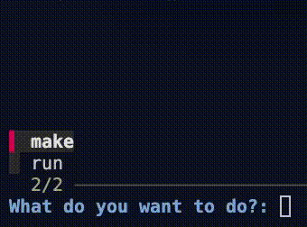

# Prabogo


**Prabogo** is a Go framework designed to simplify project development by providing an interactive command interface and built-in instructions for AI assistance. This framework streamlines common engineering tasks, making it easier for software engineers to scaffold, generate, and manage project components efficiently. With Prabogo, developers benefit from automation and intelligent guidance, accelerating the software development process.

Prabogo now uses [Spec Kit](https://github.com/github/spec-kit) to bring spec-driven development into the project, making it easier to guide your AI agent with structured commands during development.

## Design Docs

[Design Docs List](./docs)

## Spec-Driven Development

[Learn how to use Spec Kit commands](./docs/spec-driven.md) to systematically develop features with your AI agent.

## Requirement

1. go version >= go1.24.0

## Spec Kit

This repository is initialized with [Spec Kit](https://github.com/github/spec-kit) for spec-driven development. With Spec Kit, Prabogo follows a spec-driven development workflow so developers can direct AI agents more clearly through structured planning and implementation commands.

GitHub Copilot is the default integration configured in this repository today, but Spec Kit also supports other AI coding agents. If you use a different agent, you can switch the integration to match your setup.

### Install Specify CLI

Spec Kit requires Python 3.11+ and assumes `uv` is already installed.

```sh
uv tool install specify-cli --python /opt/homebrew/bin/python3.11 --from git+https://github.com/github/spec-kit.git@v0.8.4
export PATH="$HOME/.local/bin:$PATH"
specify version
```

### Initialize Spec Kit In This Repository

If you need to reinstall or refresh the Spec Kit files in this project, run:

```sh
export PATH="$HOME/.local/bin:$PATH"
specify init . --force --integration copilot --script sh
```

This installs the Spec Kit project files under `.specify/` and the GitHub Copilot integration files under `.github/agents/`, `.github/prompts/`, and `.github/copilot-instructions.md`.

### Use Another AI Agent

To see which integrations are available in your installed Spec Kit version, run:

```sh
specify integration list
```

If you use a different AI agent, reinitialize Spec Kit with the integration that matches your tool. For example:

```sh
export PATH="$HOME/.local/bin:$PATH"
specify init . --force --integration claude --script sh
```

Or:

```sh
export PATH="$HOME/.local/bin:$PATH"
specify init . --force --integration gemini --script sh
```

When you change the integration, Spec Kit rewrites the agent-specific command and instruction files for that tool. The core workflow stays the same: define principles, write specs, make a plan, generate tasks, and implement with structured agent commands.

### Main Spec Kit Commands

After initialization, you can use the generated Spec Kit commands in your configured AI agent:

```text
/speckit.constitution
/speckit.specify
/speckit.plan
/speckit.tasks
/speckit.implement
```

**Before running the app, copy the example environment file:**

```sh
cp .env.example .env
cp .env.docker.example .env.docker
```

## Start External Services with Docker Compose

```sh
docker-compose --env-file .env.docker up -d
```

## Stop External Services with Docker Compose

```sh
docker-compose down
```

## Start Authentik Services with Docker Compose

To start Authentik authentication services (includes PostgreSQL, Redis, Server, and Worker):

```sh
docker-compose -f docker-compose.authentik.yml up -d
```

## Stop Authentik Services with Docker Compose

```sh
docker-compose -f docker-compose.authentik.yml down
```

## Start Temporal Services with Docker Compose

To start Temporal workflow services (includes PostgreSQL, Elasticsearch, Temporal Server, Admin Tools, and Web UI):

```sh
docker-compose -f docker-compose.temporal.yml up -d
```

The Temporal UI will be available at http://localhost:8080 and the Temporal server will be accessible on port 7233.

## Stop Temporal Services with Docker Compose

```sh
docker-compose -f docker-compose.temporal.yml down
```

## Run App in Development Mode

To run the application directly (without Makefile or Docker), ensure all required environment variables are set. You can use a `.env` file or export them manually.

Start the app with:

```sh
go run cmd/main.go <option>
```

Replace `<option>` with any command-line arguments your application supports. For example:

```sh
go run cmd/main.go http
```

Make sure external dependencies (such as PostgreSQL, RabbitMQ, and Redis) are running, either via Docker Compose or another method.

## Makefile Commands

The project includes a comprehensive Makefile with various helpful commands for code generation and development tasks.

### Interactive Command Runner



You can use the interactive target selector to choose and run Makefile targets:

```sh
make run
```

This will display an interactive menu to select a Makefile target and will prompt for any required parameters. The selector works in two modes:

1. If `fzf` is installed: Uses a fuzzy-search interactive selector (recommended for best experience)
2. If `fzf` is not available: Falls back to a basic numbered menu selection

To install `fzf` (optional):
- macOS: `brew install fzf`
- Linux: `apt install fzf` (Ubuntu/Debian) or `dnf install fzf` (Fedora)
- Windows: With chocolatey: `choco install fzf` or with WSL, follow Linux instructions

### Common Makefile Targets

#### Code Generation Targets

- `model`: Creates a model/entity with necessary structures (requires VAL parameter)
  ```sh
  make model VAL=name
  ```

- `migration-postgres`: Creates a PostgreSQL migration file (requires VAL parameter)
  ```sh
  make migration-postgres VAL=name
  ```

- `inbound-http-fiber`: Creates HTTP handlers using Fiber framework (requires VAL parameter)
  ```sh
  make inbound-http-fiber VAL=name
  ```

- `inbound-message-rabbitmq`: Creates RabbitMQ message consumers (requires VAL parameter)
  ```sh
  make inbound-message-rabbitmq VAL=name
  ```

- `inbound-command`: Creates command line interface handlers (requires VAL parameter)
  ```sh
  make inbound-command VAL=name
  ```

- `inbound-workflow-temporal`: Creates Temporal workflow worker (requires VAL parameter)
  ```sh
  make inbound-workflow-temporal VAL=name
  ```

- `outbound-database-postgres`: Creates PostgreSQL database adapter (requires VAL parameter)
  ```sh
  make outbound-database-postgres VAL=name
  ```

- `outbound-http`: Creates HTTP adapter (requires VAL parameter)
  ```sh
  make outbound-http VAL=name
  ```

- `outbound-message-rabbitmq`: Creates RabbitMQ message publisher adapter (requires VAL parameter)
  ```sh
  make outbound-message-rabbitmq VAL=name
  ```

- `outbound-cache-redis`: Creates Redis cache adapter (requires VAL parameter)
  ```sh
  make outbound-cache-redis VAL=name
  ```

- `outbound-workflow-temporal`: Creates Temporal workflow starter adapter (requires VAL parameter)
  ```sh
  make outbound-workflow-temporal VAL=name
  ```

- `generate-mocks`: Generates mock implementations from all go:generate directives in registry files
  ```sh
  make generate-mocks
  ```

#### Runtime Targets

- `build`: Builds the Docker image for the application
  ```sh
  make build
  # Force rebuild regardless of existing image:
  make build BUILD=true
  ```

- `http`: Runs the application in HTTP server mode inside Docker
  ```sh
  make http
  # Force rebuild before running:
  make http BUILD=true
  ```

- `message`: Runs the application in message consumer mode inside Docker (requires SUB parameter)
  ```sh
  make message SUB=upsert_client
  # Force rebuild before running:
  make message SUB=upsert_client BUILD=true
  ```

- `command`: Executes a specific command in the application (requires CMD and VAL parameters)
  ```sh
  make command CMD=publish_upsert_client VAL=name
  # Force rebuild before running:
  make command CMD=publish_upsert_client VAL=name BUILD=true
  ```

- `workflow`: Runs the application in workflow worker mode inside Docker (requires WFL parameter)
  ```sh
  make workflow WFL=upsert_client
  # Force rebuild before running:
  make workflow WFL=upsert_client BUILD=true
  ```

## Running test suite

### Unit tests

```sh
go test -cover ./internal/domain/...
```

To generate coverage report:

```sh
go test -coverprofile=coverage.profile -cover ./internal/domain/...
go tool cover -html coverage.profile -o coverage.html
```

Coverage report will be available at `coverage.html`

To check intermittent test failure due to mock. when in doubt, use `-t 1000`
```sh
retry -d 0 -t 100 -u fail -- go test -coverprofile=coverage.profile -cover ./internal/domain/... -count=1
```

## License

This project is licensed under the MIT License - see the [LICENSE](LICENSE) file for details.

## Author

Moch Dieqy Dzulqaidar